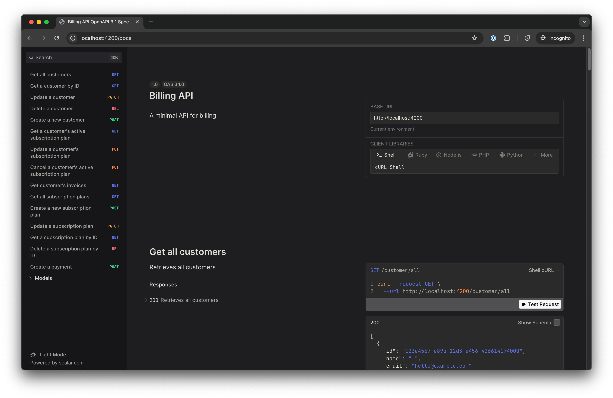

# SaaS Billing App API with Cloudflare Workers



This project implements a simple billing api for a SaaS platform using Cloudflare Workers. It supports multiple subscription tiers and handles recurring billing using TypeScript.

## Tech Stack

- **Hono**: A lightweight web framework for Cloudflare Workers. Chosen for its simplicity, excellent integration with Cloudflare (it was built by a CF dev and is used internally by CF), and optimized performance in serverless environments.
- **TypeScript**: For type-safe code and improved developer experience.
- **Cloudflare Workers**: Serverless platform for running our application.
- **Cloudflare KV**: For data storage.
- **Vitest**: For unit testing.
- **Zod**: For data validation and automatic OpenAPI spec generation.
- **date-fns**: For date manipulation.

## Setup

### Prerequisites

1. Node.js (v20.17.0)
2. pnpm (v9.11)
3. A Cloudflare account
4. A Cloudflare KV namespace

### Installation

1. Clone the repository:

   ```bash
   git clone https://github.com/karimdaghari/billing-app.git
   cd billing-app
   ```

2. Install dependencies:

   ```bash
   pnpm install
   ```

3. Set up your Cloudflare account:
   - Create a Cloudflare Workers project
   - Configure your `wrangler.toml` file with your KV namespace bindings (just create one through `pnpx wrangler kv namespace create DATA_STORE`. Make sure it's named `DATA_STORE` and don't forget to update your `wrangler.toml` with your namespace ID)

## Usage

### Prerequisite

Before your run the dev server please create a `.dev.vars` file at the root with the keys communicated to you by email.

### Development

To run the project in development mode:

```bash
pnpm run dev
```

This will start a local development server, allowing you to test your Cloudflare Worker locally.

#### Testing CRON jobs

To run cron jobs, you first need to run:

```bash
pnpm run test:scheduled
```

Once the dev server starts, you can run:

```bash
pnpm run test:scheduled-invoices
```

This'll run the `generate-invoices` cron job.

Or you can also run:

```bash
pnpm run test:scheduled-failed-payments
```

To run the `retry-failed-payments` cron job.

### Testing

To run the test suite:

```bash
pnpm run test
```

This will execute all tests using Vitest.

## Deployment

To deploy your worker to Cloudflare:

1. Ensure your `wrangler.toml` is correctly configured.
2. Run:

   ```bash
   pnpm run deploy
   ```

## Project Structure

The project structure is organized as follows:

- `src/`: Contains the main source code for the application
  - `cron/`: Cron jobs
  - `db/`: Database-related code and models
    - `models/`: Zod/OpenAPI schemas for data models
    - `client.ts`: A client for the KV, with typed helpers for the database models
  - `lib/`: Reusable functions and helpers
  - `middleware/`: Middlewares to be used across the app
  - `routers/`: Request handlers for different API endpoints
    - `index.ts`: The entry point for the routers
    - `customer/`: Customer-related endpoints
      - `index.ts`: The actual router/where the endpoints are
      - `lib.ts`: Helper functions for customer-related operations
      - `invoice/`: Customer-related invoice endpoints
      - `subscription-plan/`: Customer-related Subscription plan endpoints
    - `subscription-plan/`: Subscription plan-related endpoints
    - `payment/`: Payment-related endpoints
  - `services/`: Business logic and core functionality
    - `billing/`: Billing-related calculations and tests
    - `email/`: Email sending functionality
  - `index.ts`: The entry point for the app (exposes both the API and the scheduler for the cron jobs)
- `.dev.vars`: Development environment variables (gitignored)
- `.example.vars`: Example environment variables for reference
- `.nvmrc`: Node version specification
- `biome.json`: Biome configuration (Replaces ESLint+Prettier to ensure some structural consistency)
- `package.json`: Project dependencies and scripts
- `tsconfig.json`: TypeScript configuration
- `wrangler.toml`: Cloudflare Workers configuration
- `challenge_spec.pdf`: The spec on which this whole thing was based
- `README.md`: Project documentation (this file)

### Notes

- This structure is made to separate concerns, making the codebase modular and easier to maintain but at the same time, collocation is used where it makes most sense.
- Each directory (and its related `index.ts` file) in the `routers` folder corresponds to a router.

## API Documentation

[!INFO] You need to be connected to internet to run the docs.

The API documentation for this project is available as an OpenAPI v3.1 specification. You can access the full API reference by visiting the `http://localhost:4200/docs` endpoint when the server is running.

This interactive documentation provides detailed information about all available endpoints, including:

- Expected request formats and parameters
- Response schemas and examples
- Error handling strategies and status codes

To explore the API:

1. Start the server (see "Development" section above)
2. Navigate to `http://localhost:4200/docs` in your web browser
3. Use the interactive interface to test endpoints and view detailed specifications

For the most up-to-date and comprehensive API information, please refer to the `http://localhost:4200/docs` endpoint.

## References

- [Prorated billing 101: What it is, how it works, and how to use it by Stripe](https://stripe.com/en-sg/resources/more/prorated-billing-101-what-it-is-how-it-works-and-how-to-use-it)

## Important design decisions

### Prorated billing

[!NOTE] See `src/services/billing/index.ts`.

Prorated billing was developed to be as accurate as possible, in fact it's what required `date-fns` in the first place as it allows us to accurately get the number of days within a give date/year. So we don't even have to think about leap years -- it's all taken care of for us.

### Invoice generation

[!NOTE] See `src/cron/generate-invoices.ts`.

In order to generate invoices, properly tracking (upgrade/downgrade) subscriptions was required and as such a new entity `CustomerSubscriptionPlan` was added which basically acts as a relational table between `Customer` and `SubscriptionPlan` and more, (e.g., when was the subscription activated, when did it end etc...).

This also allows us to separate subscription management from invoice management. The first is concerned with the "what" (what subscription is the customer on) and the latter is concerned with the "how" (namely, how much they'll pay).

Every day at 10 am a cron job is executed to generate the invoices for the plan that end on that day. This is to ensure that the invoices are generated with the correct subscription plan, the correct amount and the correct billing period.

> Why at 10 am?
> So that if the system fails, at that time in the morning a developer should be at ready to diagnose and fix the problem.

### Payment processing

[!NOTE] See `src/services/payment/index.ts` and `src/cron/retry-failed-payments.ts`.

Payment processing is handled through a combination of scheduled tasks and service functions. Here's an overview of how it works:

1. **Invoice Generation**: Invoices are generated daily at 10 AM through a scheduled cron job.

2. **Initial Payment Attempt**: When an invoice is generated, the customer should be attempting a payment.

3. **Failed Payments Retry**: If the initial payment fails, a retry mechanism is implemented:
   - A cron job runs daily at 11 AM to retry failed payments.
   - This is implemented in the `retryFailedPayments` function in `src/cron/retry-failed-payments.ts`.

The `retryFailedPayments` function does the following:

1. Fetches all invoices and payments from the database.
2. Identifies invoices with a "failed" payment status.
3. Matches these failed invoices with their corresponding failed payments.
4. For each failed payment:
   - Attempts to process the payment again using the `processPayment` service.
   - Updates the payment and invoice status accordingly.
   - Sends email notifications about the payment status.

This retry mechanism ensures that temporary issues (like insufficient funds or temporary card declines) don't immediately result in service interruption for the customer. It gives a grace period for the payment to go through successfully.

## Future improvements

- Add authentication (using JWT: <https://hono.dev/docs/middleware/builtin/jwt>)
- Improve logging to have full visibility on every nook and cranny (e.g., Sentry)
- Implement [CORS](https://hono.dev/docs/middleware/builtin/cors) and add other security mesures (.e.[g, CSRF](https://hono.dev/docs/middleware/builtin/csrf))
- Add rate limiting
- Add a new entity `InvoiceItems` that would add more details to the invoice (so instead of having just the full amount, we'd have different amounts if we've changed subscriptions)
- Use Cloudflare Durable Objects or, ideally, D1

---

## Task 2-2: Code Refactoring

For the following task, identify at least 3 problems in the code.

### Problematic Code

```javascript
app.get('/product/:productId', (req, res) => {
  db.query(`SELECT * FROM products WHERE id=${req.params.productId}`, (err, result) => {
    if (err) throw err;
    res.send(result);
  });
});
```

### Problems

1. **SQL Injection**: The code is vulnerable to SQL injection attacks.
2. **Lack of input validation**: The code is not validating the input properly. It's just using the input as-is.
3. **Lack of proper error handling**: The code is not handling errors properly. It's just rethrowing the error which might contain sensitive information.
4. **No use of async/await**: The code is not using async/await which makes it harder to read and understand.
5. **Overfetching**: The code is overfetching. It's fetching all the columns from the database. Whereas we might only need a subset of them.
6. **No use of a proper ORM**: The code is not using a good/proper ORM or query builder. It's using raw SQL queries. Which makes it harder to maintain and scale.
